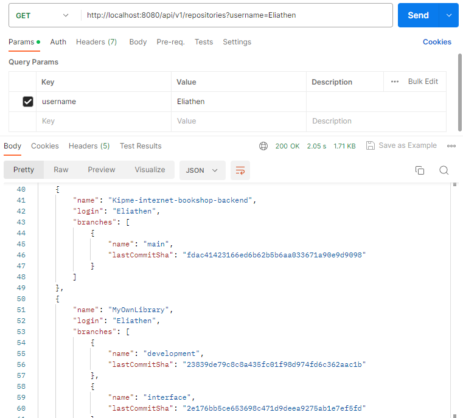

## Technologies

- [Kotlin](https://kotlinlang.org/)
- [Spring Boot 3](https://spring.io/projects/spring-boot)
- [Gradle 7.6](https://gradle.org/)

## Execute

Clone the application:

```shell
git clone https://github.com/Eliathen/Atipera.git
```

Running tests:

```shell
./gradlew test
```

Run application:

```shell
./gradlew bootRun
```

## API

| Methods | Urls                                     | Actions                                         |
|---------|------------------------------------------|-------------------------------------------------|
| GET     | /api/v1/repositories?username=[username] | retrieve repositories with branches by username |

### Swagger docs

Run the server and browse to http://localhost:8080/api/v1/swagger-ui/index.html

## Example

